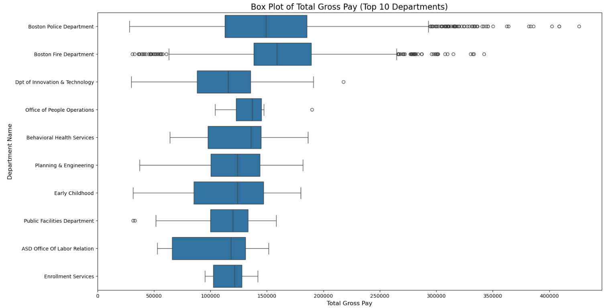

# CS 506 Boston Budget Final Project
### YT Presentation Link: https://youtu.be/VOY79GzFD28
## Operating Budget

The operating budget is the expenses generated to run the government on a day-to-day basis. This dataset contains columns such as Department, Programs, FY22 spending, FY23 Spending, FY24 spending, and the budget for FY25. ‘FY’ in this case refers to Fiscal Year, which means a one year period that the government or other organization used for financial reporting. When looking at this dataset, there was a lot of missing data (seen as ‘#Missing’ in the operating budget, which was replaced by 0). Some programs have missing data for the fiscal year of FY22 - FY24. We removed them for this visualization.

### Program Spending

The "Top 10 Programs by Largest Spending (FY22 - FY24)" bar chart displays the most significant financial allocations across various programs within a specified period, emphasizing the key areas where funds are primarily directed. The program with the highest spending is "Pensions," with expenditures exceeding $1 billion, signifying a substantial investment in retiree benefits. Following closely are "BPS Finance" and "BPS Operations," highlighting significant funding for Boston Public Schools' administrative and operational costs. Other high-expenditure areas include "Charter School Tuition," "Boston Fire Suppression," and "Health Insurance," illustrating priorities in education, public safety, and employee benefits. "Bureau of Field Services" and "Debt Service" also command notable portions of the budget, reflecting essential services and fiscal responsibilities. Programs for "K-8" and "Elementary" education round out the top ten, indicating strong support for foundational educational services. This distribution of funds underscores a balanced approach to addressing pensions, education, public safety, and essential services in the city's budget strategy.

The bar chart titled "Top 10 Programs by Smallest Total Spending (FY22 - FY24)" highlights the programs that received the lowest funding within this period, with allocations generally below $0.3 million. "Human Rights History" and "Equity & Inclusion History" are the least funded programs, reflecting a minimal budget allocation towards these historical and social initiatives. Other low-funded areas include "Internal Affairs Oversight Panel (IOAP)" and "Trust," suggesting limited financial support for oversight and trust-building functions. Programs like "Civilian Review Board (CRB)," "Consumer Affairs," and "Diversity" receive modest funding, indicating these areas are relatively low on the city's fiscal priorities. Meanwhile, "Coordinated Response Team," "Grants Administration," and "Tourism" have slightly higher, yet still minimal, budgets, showing restrained investments in emergency response coordination, administrative support, and tourism. Overall, these allocations suggest that, compared to other sectors, these programs are designated as lower-priority areas within the city's budgetary strategy.

The chart displays the top 10 programs in Boston with the highest budget growth from fiscal year 2022 (FY22) to fiscal year 2024 (FY24), reflecting key city priorities. Leading with around 600% growth, the Trust program tops the list, followed closely by Revenue Monitoring at approximately 550%, signaling a focus on revenue oversight. Programs related to Equity and Affirmative Action saw growth near 500% and 400%, respectively, indicating a strong commitment to inclusion and diversity. The Mayor’s Office of Community Safety experienced similar growth, emphasizing public safety. Programs like Program & Partnerships and Turnaround and Transformation grew around 300%, likely supporting reform and collaboration efforts. Additionally, significant investments in LCA (Language and Communication Access), Office of Civic Organizing, and Small & Local Business reveal a focus on civic engagement and local economic development. These budgetary increases demonstrate Boston’s strategic emphasis on equity, safety, financial stability, and economic support for local communities. Future analysis could examine the impacts of these investments to ensure they achieve the intended social and economic outcomes.

## Capital Budget Analysis

### Overview
The **Capital Budget dataset** for Boston’s FY25 outlines planned investments in the city's infrastructure and public assets. It includes detailed information about each project, such as the managing department, project name, scope, target neighborhood, and allocated budget. This budget focuses on long-term improvements for city facilities, roads, parks, and other community spaces, reflecting Boston’s commitment to maintaining and developing public infrastructure.

Notably, there was no missing data, so no preprocessing was required for this dataset.

---

### Geographic Spending

We examined the capital budget by geography (neighborhood) to understand if funding aligns with population needs and to uncover potential geographic disparities in spending. By looking at total spending and per capita spending, we aimed to see which neighborhoods receive the most funding in absolute terms and relative to their populations. This geographic breakdown helps identify areas where Boston may prioritize development, maintenance, or economic revitalization and sheds light on possible funding imbalances across neighborhoods.

#### **Total Project Budget by Neighborhood**

- **Citywide** received the highest funding overall, likely supporting projects that benefit the entire city. 
- Among specific neighborhoods, **Charlestown**, **Downtown/Government Center**, and **Roxbury** received significant funding allocations. 
  - These areas may have higher project needs, such as infrastructure improvements or community development initiatives.

**Distribution of Project Status**

This pie chart shows the distribution of project statuses for Boston’s FY25 capital projects, offering insight into the stages of various city initiatives: 
- The large proportion of projects **"In Design"** and **"To Be Scheduled"** suggests a focus on forward planning and preparation. 
- The **"Annual Program"** and **"In Construction"** categories demonstrate that Boston also prioritizes active and recurring projects, ensuring both new and essential services are being maintained. 

### Per Capita Spending by Geography

To meaningfully compare budget allocations relative to population, we: 
1. Collected population data from the **2020 Census**. 
2. Aligned neighborhood names between the census and the capital budget datasets.
3. Merged the population data with the capital budget to calculate **per capita spending**

This process uncovered potential geographic disparities in funding.

#### **High Budget Per Capita**

- **Chinatown**, **Charlestown**, **Downtown/Government Center**, and **North End** have high budgets per capita. 
  - These are central or historically significant areas. 
  - Funding likely supports infrastructure, tourism, economic development, and historical preservation. 
  - This trend indicates prioritization of central or historically significant neighborhoods, possibly to maintain attractiveness for tourism and economic activities. 

#### **Low Budget Per Capita**

- Neighborhoods like **Allston/Brighton**, **Fenway-Kenmore**, and **Hyde Park** receive lower budgets per capita despite substantial populations. 
  - These areas might not receive the same level of investment due to their distance from the city center or primarily residential nature. 
  - This could suggest a lower emphasis on neighborhood-specific projects in these areas, possibly due to fewer economic or historical landmarks.

---

### Immigration Percentage by Neighborhood

- #### **Highest Immigration Percentages** 
  - **East Boston** has the highest immigrant population percentage, standing out significantly from other neighborhoods. 
  - **Chinatown** and **Fenway-Kenmore** also have notable immigrant representation.
- #### **Moderate Immigration Percentages** 
  - Neighborhoods like **Allston/Brighton**, **West End**, and **Mission Hill** exhibit moderate immigrant percentages. 
- #### **Lowest Immigration Percentages** 
  - **South Boston**, **North End**, and **Charlestown** have the lowest percentages, indicating fewer immigrant populations relative to their total populations.

---
### Immigration and Total Budget per Neighborhood

#### Observations
1. **East Boston**:
  - Despite having the highest immigration percentage, it does not have the highest total budget allocation.
  - Suggests a potential disparity between immigrant populations and funding. 
2. **Chinatown**:
  - Receives significant budget allocation compared to its relatively high immigrant population. 
3. **Dorchester**: 
  - While it has moderate immigration percentages, it receives substantial funding, likely due to prioritization of infrastructure or development needs.

#### Insights
- **Spending Patterns**: Some neighborhoods with high immigrant populations (e.g., **East Boston**, **Fenway-Kenmore**) do not receive proportional funding. 
- **Policy Implications**: Highlights an opportunity to assess funding distribution to ensure alignment with demographic needs, particularly in neighborhoods with large immigrant communities.
- **Outliers**: Neighborhoods like **Chinatown** and **Dorchester** seem to receive higher budgets relative to their immigrant percentages, suggesting additional factors influence spending decisions.

--- 

### Department Spending

For department spending, we looked at the Boston City government planned capital budget for FY25 - FY29. 

- The clear leader in financing is going to be the Boston Public School Department taking up more than 25%. The following data makes sense as a large number of schools in the area require constant government funding to support their facilities and maintenance. On top of that staffing and salaries along with various student needs require significant financial resources. 
- A lot of the spending is going to be directed towards the Public Works Department. The city is planning to renew its infrastructure and the allocated costs show this very well. Worth noting,  the mentioned department also covers a lot of environment-directed initiatives such as recycling and waste management, which became a trend in big cities over the recent time.
- Further, a lot is also invested in renovating the city as a whole as Property Management and Park and Recreation are the next 2 biggest spending categories. A lot of space planning and maintenance repairs are going to be done by the city within the next 5 years.

## Checkbook Data

### General Information

For these visualizations, we decided to use the checkbook spending data. According to the website, the checkbook data, “provides up-to-date financial information about the City’s expenditures [and] … is updated monthly, with certain personal information omitted in order to ensure privacy” (https://data.boston.gov/dataset/checkbook-explorer). It is important to note that this data does not contain any payroll information. There were individual data files for each fiscal year from 2011 to 2024, so we needed to concatenate all the datasets. Here were our processing steps:

### Preprocessing and Cleaning Data

**Data Standardization** (standardize_column_names function):
This function handles the messy reality of government data where column names might be inconsistent across fiscal years. It creates a standardized format by converting everything to lowercase and replacing spaces with underscores. There's a specific mapping dictionary that handles common variations in column names (like 'vendor name' → 'vendor_name').
**Data Type Processing** (process_data_types function):
Given we're dealing with financial data, it's crucial to ensure consistent data types. We convert dates in the 'entered' column to proper datetime format. Handle department names by converting them to strings and filling any missing values with 'Unknown'. Then, we properly format monetary amounts by removing currency symbols ($) and commas, converting them to float values.
**Save Function** (save_dataframe function):
Ensures dates are saved in a consistent MM/DD/YYYY format. Uses UTF-8 encoding with BOM (byte order mark) to handle special characters.
**Main Processing Function** (process_checkbook_files):
This is where the heavy lifting happens for combining fiscal years 2011 - 2024. Uses a glob pattern to find all checkbook CSV files in the specified directory. Read each file with specific data type specifications to prevent issues. Applies the standardization and data type processing to each file. Concatenates all the fiscal year data into one comprehensive dataset. Saves the final cleaned dataset.

### Exploratory Analysis

Our group had to map departments to their assigned cabinets, this was done by looking at the Boston city government structure (https://www.boston.gov/departments/311/city-boston-government) on their official website and the operating budget dataset. Then, we aggregated total expenditures made by each cabinet per month and graphed the trend lines below.

As expected, the education cabinet (which only contains the Boston Public School department), has made plenty of expenditures month-over-month. It is expected to see fluctuations in spending (as we shouldn’t see a cabinet consistently spending high amounts of money every single month). However, it is interesting to note that spending seems to have increased significantly past the year 2022. This could reflect the introduction of new programs meant for students or new facilities being built.

Here is an interesting case with the Equity & Inclusion Cabinet. We actually see little to no spending prior to the year 2020, however, around the year 2021 we notice a significant increase in spending by this cabinet. This timing aligns with broader societal shifts and Boston's enhanced focus on equity initiatives surrounding racial justice movements and communities of color. The increased spending reflects the City's commitment to addressing systemic inequities through dedicated resources and programs. It's worth noting that prior to 2020, equity and inclusion initiatives may have been distributed across other departments or cabinets, making it harder to track total spending in these areas.

As we were investigating cabinets, we reached an unusual graph. The People Operations Cabinet consists of these departments: Labor Relations, Human Resources, Workers Compensation Fund, Health Insurance, Registry Division, and Office of People Operations. The majority of spending prior the year 2022 is due to health insurance, so it is pretty odd that spending suddenly dropped for the People Operations Cabinet. We decided to investigate further as to why health insurance spending decreased for 2023, and we managed to find an official news article released by mass.gov (https://www.mass.gov/news/health-insurance-plan-default-enrollment-placements-for-benefits-effective-july-1-2023) that talked about a merger betwen different health plans. However, this does not seem relevant to health insurance spending by the People Operations Cabinet and the noticeable drop in spending. If we actually look at official documentation for the operating budget for health insurance, notice how spending is actually increasing rather than decreasing from fiscal year 2020 to fiscal year 2023 (the file can be found publicly available by searching for "boston people operations cabinet health insurance", but I have provided a screenshot below). 

Our group concluded that the checkbook data is not a reliable dataset to look at due to mismatches in spending (in this case, the health insurance department under the People Operations Cabinet). There are a lot of potential reasons for the differences in official documentation and what the data shows. It is possible that health insurance for employees no longer needs to appear as a transaction in the checkbook data. However, we can not make this confirmation unless we speak to the City and ask how they have been collecting individual expenditures made by each individual department.

## Boston Utility Data

### General Information

According to this [link](https://data.boston.gov/dataset/city-of-boston-utility-data), the City of Boston collects monthly utility data for all its accounts, which comes from its Enterprise Energy Management System. One file for utility bills was provided (note that the dataset is constantly being updated).

### Preprocessing and Cleaning Data

When it comes to cleaning the data, first we needed to handle all the different typos in department naming. Our group decided to manually create a dictionary mapping and change the abbreviation of a department to its full name for better readability. Any values in the 'DepartmentName' column that is NA is simply replaced with the string 'UNKNOWN'. When it comes to plotting energy spending over time, we had to group the data at a monthly frequency based on the 'InvoiceDate'. We then pivot the table so that the 'InvoiceDate' is the index, the columns are 'DepartmentName', and the values within each cell is 'TotalCost'. 

### Exploratory Analysis

Our group was interested in these specific departments: 'Boston Public Schools' and 'Boston Transportation'. 

**Boston Public Schools**:

Let's investigate Boston Public Schools. In the figure below, we also included a light grey region to represent winter months. Looking at the graph, the overall spending is a lot more compared to the rest of the departments. This is to be expected (you can look at how much money is being allocated to the Boston Public Schools system in the analysis at the beginning of this README document). The amount of spending in energy is relatively consistent from 2011 to 2019 in a seasonal pattern. Spending increases during the winter months, most likely due to heating large buildings throughout the day. It is also important to note that there are most likely older, less efficient systems in many schools which can lead to greater costs. Schools have a wide range of things that can consume a lot of energy. For instance, indoor and outdoor lighting (classrooms, hallways, common areas, athletic fields), computing (computer labs, smartboards, projectors, servers), and kitchen equipment (industrial refrigerators and freezers, stoves and ovens, food preparation equipment). Another interesting region to look at is during COVID. Notice how spending seems to decrease and doesn't really increase until past 2021. What is unusual is that spending suddenly spikes past 2021 and maintains much higher peaks and drops compared to previous years. There can be many reasons, one of them could be due to new buildings being added or it could be some data collection error (look at 2024, where we see the highest peak). 

In regards to energy type breakdown, nearly half of Boston Public Schools' energy comes from electricity. Our group is pretty surprised about how around 19% of energy comes from water. This is great to see, as we want high energy usage departments to start transitioning to reliable, sustainable and affordable clean energy. Regarding natural glass, it does have some great qualities. According to the [United States Energy Information Administration (EIA)](https://www.eia.gov/energyexplained/natural-gas/natural-gas-and-the-environment.php), it states, "Burning natural gas for energy results in fewer emissions of nearly all types of air pollutants and carbon dioxide (CO2) emissions than burning coal or petroleum products to produce an equal amount of energy." In other words, it is a pretty efficient energy source that is able to cleanly burn compared to things like coal and oil. However, it is still a producer of greenhouse gas as it is composed mainly of methane. Our group wonders if other sources of renewable energy such as wind or geothermal (like Boston University's Center of Computing and Data Sciences) would ever be used, especially for such an energy intensive department.

**Boston Transportation Department**:

Let's investigate the Boston Transportation Department. This department has much less spending compared to Boston Public Schools. There is increased spending during the winter months, which is to be expected. However, we once again notice a sudden spike in spending and continued volatility in spending past the year 2021. Given that this is also happening in Boston Public Schools, we are suspecting that there might be something happening in the way the data is collected (the system could be missing essential invoice data for certain departments) because spending should not suddenly double. It is safe to ignore later months for the year of 2024 because the data hasn’t been aggregated yet. 

In regards to energy type breakdown, this was expected. The following information has been retrieved from this website [here](https://www.mbta.com/sustainability/greening-the-fleet-decarbonizing-the-mbta). The Massachusetts Bay Transportation Authority (MBTA) operates the fully electric subway and light rail lines, which includes: the red, blue, orange, green lines (for the green line, there was a complete overhaul so that new trains would have efficient HVAC systems and regenerative braking). However, for buses, a majority of the fleet still relies on diesel, which "consumes more fuel and generates more greenhouse gas" (1). Fortunately, hybrid buses and battery buses were introduced in 2010 and 2019 respectively and their is an ongoing, active transition to these versions. This department is the least of our concerns in regards to energy spending, but there might be an argument for increasing the budget for this department. 

**Amount of Invoices Across Each Year and Energy Type (All Departments Considered)**

When we look at the amount of invoices across the year and look at the energy type percentage make up for each year, there are a few important things to consider. Electricity has remained pretty consistent since 2011, making up around 70% to 80% of invoices for each year. This is the same for natural gas usage, which makes up around 8% to 10% for each year. Besides this, our group noticed the increased percentage of water invoices. This could reflect the City of Boston's commitment in pursuing hydropower, a renewable energy source that is abundant. However, since the year of 2024 is not finished, the proportions may be inaccurate as we have not collected and aggregated all invoices for the year. Oil energy invoices only appears in the years 2017 to 2019, possibly due to some project that requires it, and steam energy invoices do not appear at all. 

## Boston Employee Earnings Data

### General Information

According to this [link](https://data.boston.gov/dataset/employee-earnings-report), the City of Boston publishes its payroll data for its employees, providing features like the name of the employee, the job they are working, and the amount they make from their base salary and overtime. For the following cleaning and analysis, our group will only be focused on the years from 2021 to 2023 and focus on a select few departments. 

### Preprocessing and Cleaning Data

First, we needed to standardize column names across all separate datasets. This would allow us to easily concatenate the data frames vertically. The end product is a stacked data frame with employee earnings information from years 2021 to 2023. The main issue in the combined dataset now is standardizing department names. One big issue is that a lot of department names are not being aggregated to a single department. For example, 'Chief Academic Officer;, 'Eliot K-8', 'Murphy K-8', 'Curley K-8', 'Madison Park Tech Vocational', 'Quincy Elementary', 'Tynan Elementary',  'Trotter Elementary', 'Lyon High', 'Dearborn 6-12 STEM Academy', 'Warren-Prescott K-8', 'Edison K-8', etc. should all fall under the Education label. This means that our group needed to identify keywords associated with education, such as 'Elementary', 'High', 'Academy', etc. through regular expressions, then we simply assign it to the 'Education' department. Other departments like the 'Boston Police Department' and the 'Boston Fire Department' do not have these naming variations.

### Exploratory Analysis

Let's focus our analysis on 'Education Department', 'Police Department', and the 'Fire Department'. We do this by filtering by the specific department name and focusing on 'Regular', 'Overtime', and 'Total Gross' columns.

**Comparison of Median Pay Components**

The reason why our group decided to choose to look at the median of pay components is because the departments have plenty of outliers, which can influence the mean heavily. So, we are treating the median as a slightly more robust measure. Starting with the median base pay, the fire department has the highest out of the other two departments. This seems to be pretty reasonable to us because besides dealing with fires, they need to help with vehicular accidents, hazardous material incidents, rescue operations, and medical assistance (see [here](https://www.boston.gov/departments/fire-operations#:~:text=We%20respond%20to%20emergencies%20including,events%20held%20in%20the%20city.)). They need to deal with high-risk cases and need to always be on standby (the same could be said about police). Another interesting thing to note is that education base pay is higher than police base pay. But, we can observe the large disparity when we look at total gross pay. This means that there are plenty of other incentives for police officers, which includes the Quinn Bill (which provides education funding for police officers) and plenty of overtime opportunities (night shifts, court appearances, planned events, holidays). Note that arguments have been brought up about how police officers might actually be abusing overtime to get higher pay, with some actually getting caught and arrested. See this press release by the Department of Justice [here](https://www.justice.gov/usao-ma/pr/nine-boston-police-officers-arrested-overtime-fraud-scheme).

**Distribution of Total Gross Pay**

If we actually look at a distribution or histogram, with the x-axis being total gross pay and the y-axis being frequency, we could see that the police and fire department have similar distributions, which looks like a flattened normal curve. They don't have many employees relative to the education department and the variance in total gross pay is massive (some employees are making only $50000, which is not sufficient for cost of living in Boston), while others are exceeding $200000 in total gross pay. The center of the distribution for both the police and fire department seems to fall at around $150000. There are a lot more employees in the education department, and we do see that a lot of employees have between $100000 to $150000 in total gross pay (observe the peak of the education distribution), but they never seem to exceed the $200000 in total gross pay.

**Box Plot of Total Gross Pay (Top 10 Departments)**

Notice the amount of outliers for both the police department and fire department. In addition, their medians and the range of total gross pay for these departments is significantly greater than the rest of the departments. They both have a lot more employees than the rest of the departments (please look at the exploratory data analysis notebook to get summary statistics). An interesting case is that the Office of People Operations, Enrollment Services Department, and the Office of Labor Relations, only have 6, 10, and 11 employees respectively. These departments are still considered as the top 10 departments in terms of median total gross pay (we could possibly dealing with executives or high ranking board members, rather than the ordinary employee). Our group wonders if there is some opt-out option to not have salary data publicly available, especially since the data already provides sensitive information like the name of the employee and their role in a specific department. It would be ideal to have access to a larger corpus of employee data as it may uncover some interesting insight about employee paychecks.

